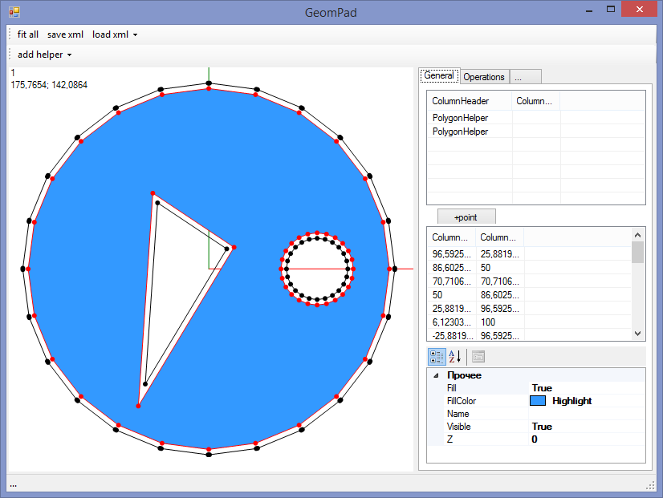
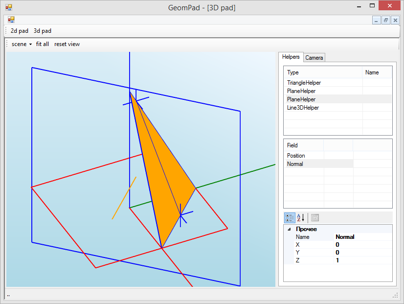

# GeomPad
**Status:** WIP

2D:

3D:

# Based on: 
* polybooljs (https://github.com/velipso/polybooljs)
* polyBoolCS (https://github.com/StagPoint/PolyBoolCS)
* clipper (http://www.angusj.com/delphi/clipper.php)
* DeepNest (https://github.com/Jack000/Deepnest)
* DeepNestPort (https://github.com/fel88/DeepNestPort)
* Original Triangle code by Jonathan Richard Shewchuk, http://www.cs.cmu.edu/~quake/triangle.html
* Triangle.NET code by Christian Woltering, http://triangle.codeplex.com/
* NURBS (https://www.codeproject.com/Articles/1095142/Generate-and-understand-NURBS-curves)
